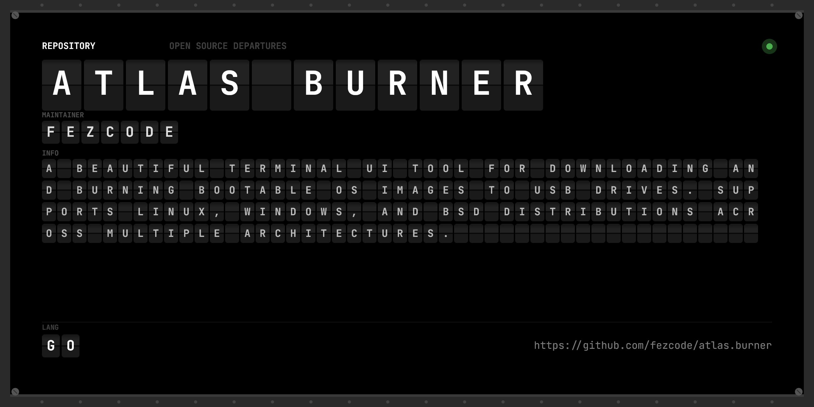

# Atlas Burner



**atlas.burner** is a beautiful, interactive TUI application for downloading OS images and burning them to USB drives. Part of the **Atlas Suite**.


## ✨ Features

- 🖥️ **OS Library:** Browse and download popular operating systems directly from the TUI.
- 💾 **USB Detection:** Automatically list connected removable USB devices.
- 🔥 **Direct Burn:** Write downloaded ISO images directly to your selected USB drive.
- ⌨️ **Vim Bindings:** Navigate using your keyboard.
- 📦 **Cross-Platform:** Binaries available for Windows, Linux, and macOS.

## 🚀 Installation

### From Source
```bash
git clone https://github.com/fezcode/atlas.burner
cd atlas.burner
gobake build
```

## ⌨️ Usage

Simply run the binary to enter the TUI (requires administrator/root privileges to write to block devices):
```bash
sudo ./atlas.burner
# or run as Administrator on Windows
```

## 📄 License
MIT License - see [LICENSE](LICENSE) for details.
